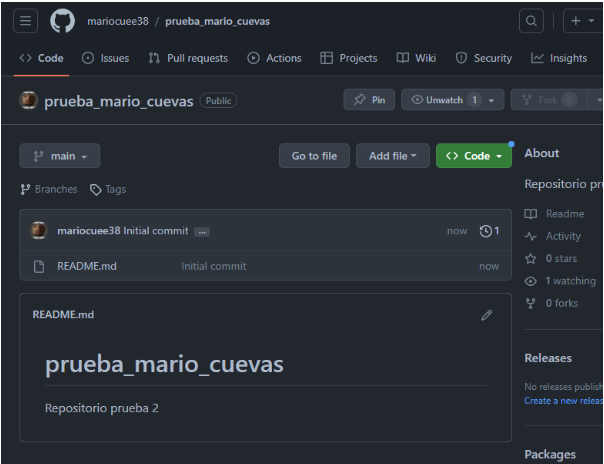
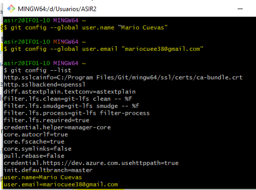
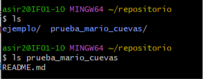
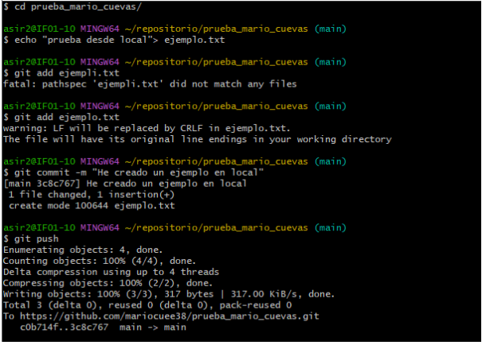
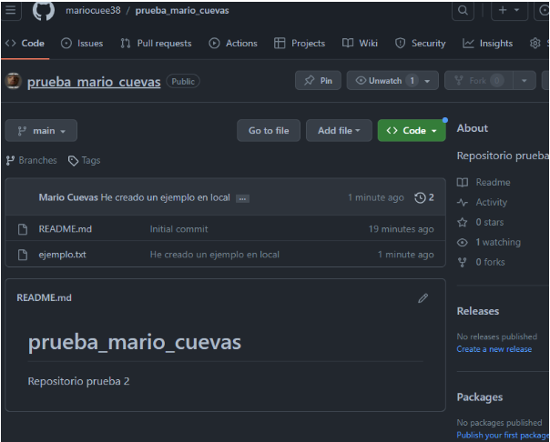
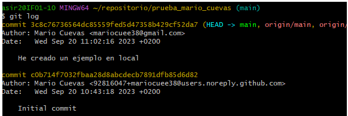
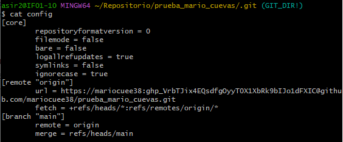

# TALLER 1

### Creo el repositorio:

### Cambio los datos de correo y nombre:

### Hago el clone añadiendo (USUARIO:TOKEN@) antes de github.com

### Comprobacion de que ya tengo prueba_mario_cuevas

### Creo un fichero nuevo en local para probar a subirlo a remoto:

### Compruebo que en GitHub se actualizó:

---

## Logs

## Fichero config:

