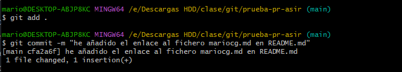

## Taller 4 Pull request

* He entrado al enlace a la pagina Github del profesor, y creo un fork nuevo

* En mi directorio ya tengo la copia del repositorio 

* Ahora lo voy a clonar para trabajar con el en local... desde el Git Bash: 

* Procedo a poner mi documento mariocg.md en el directorio files:

* Una vez guardado, hago todo el proceso para subirlo... 
1. >git add .
2. >git status para verificar si el archivo está preparado
3. >git commit -m "mensaje"

* Ahora crearé el enlace a mi archivo en el README.md 

* >[nombre a mostrar] (ruta)

* De nuevo preparo para subirlo...

* Una vez acabe el trabajo en local lo vuelvo a subir al remoto
>git push origin main

* Desde el GitHub, en el repositorio que acabo de actualizar, voy a `pull requests` para solicitar al profesor que acepte mis cambios.

* `create pull request` y le pones un mensaje...

* Y queda a la espera de que el propietario me acepte el pull request para que se apliquen los cambios...